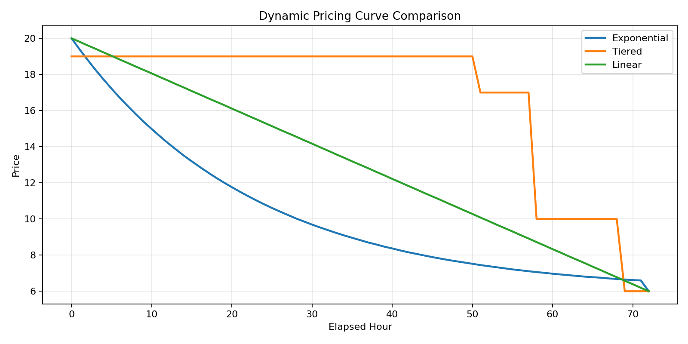

# 社区临期食品低碳减损平台（Food Saving Platform）

前后端分离的演示/教学项目：居民选购临期商品、商家核销、管理员运营；订单与碳减排挂钩，并提供 **碳积分（Carbon Coins）** 与 **游戏化商城**（虚拟树、徽章、优惠券），优惠券可在 **购物车结算时自动抵扣实付**。

| 层级 | 技术 |
|------|------|
| 后端 | Spring Boot 3.2、Spring Security、JWT、MyBatis-Plus、MySQL、Redis |
| 前端 | Vue 3、Vite、Pinia、Vue Router |

---

## 功能概览

- **居民**：选择社区、浏览商品、购物车、下单（钱包支付）、订单与核销码、**低碳中心**（碳积分与流水；累计碳减排以 **g CO₂** 展示，与成就海报口径一致）、**成就海报**（分享图）、**碳积分商城**（兑换树/徽章/券；进入商城/兑换前与订单流水自动对齐积分）、购物车选用 **未使用优惠券** 自动减价、**社区商家列表（即使商家暂无在售商品也可见）**、**商家详情页（查看商家信息与全部商品状态）**、商城大厅主要操作按钮与「加入购物车」**统一主色**、个人中心余额记录仅展示最近2条消费  
- **商家**：商品管理、订单、核销、评价、仪表盘  
- **管理员**：仪表盘、商户管理（列表/详情统计/删除）、社区与分类、全站订单、操作日志、站内提醒等  

---

## 环境要求

- JDK 17  
- Maven 3.9+  
- Node.js 18+  
- MySQL 8+  
- Redis 6+（默认 `localhost:6379`）  

---

## 数据库初始化（首次必做）

1. 在 MySQL 中创建库（若尚无）：

   ```sql
   CREATE DATABASE IF NOT EXISTS food_saving CHARACTER SET utf8mb4 COLLATE utf8mb4_unicode_ci;
   ```

2. 按顺序执行（均在仓库 `docs/sql/` 下）：

   | 脚本 | 说明 |
   |------|------|
   | `init.sql` | 基础表与示例数据 |
   | `schema-compat.sql` | 兼容补丁（补列等） |
   | `demo-seed.sql` | 演示种子数据（推荐） |
   | `carbon-gamification.sql` | **碳积分兑换表、用户优惠券表、订单优惠字段**（游戏化与下单用券） |
   | `refresh-demo-products-expiry.sql` | 将演示商品 `expire_datetime` 顺延约 **730 天**（居民端不展示已过期商品） |

   **推荐**：使用下方 `setup-demo.ps1` 一键执行上述脚本（种子后会自动执行 `refresh-demo-products-expiry.sql`，并含 `carbon-gamification.sql`）。若仅发现「选社区后无商品」，也可单独执行该 refresh SQL。

   手动执行示例（请按本机修改用户、密码、路径）：

   ```powershell
   mysql -u root -p food_saving < docs/sql/init.sql
   mysql -u root -p food_saving < docs/sql/schema-compat.sql
   mysql -u root -p food_saving < docs/sql/demo-seed.sql
   mysql -u root -p food_saving < docs/sql/carbon-gamification.sql
   mysql -u root -p food_saving < docs/sql/refresh-demo-products-expiry.sql
   ```

   说明：后端启动时也会对部分表做 **自动补表/补列**；已跑过 `carbon-gamification.sql` 或与之一致时，重复执行一般安全（`CREATE IF NOT EXISTS`、按列检测的 `ALTER`）。居民端商品列表会过滤 `expire_datetime <= NOW()` 的商品，过期跑一遍 `refresh-demo-products-expiry.sql` 即可恢复演示。

---

## 推荐：一键初始化演示库（Windows）

```powershell
powershell -ExecutionPolicy Bypass -File .\scripts\setup-demo.ps1
```

默认连接：`localhost:3306`，用户 `root`，密码 `EA7music666`，库名 `food_saving`。  
覆盖密码示例：

```powershell
powershell -ExecutionPolicy Bypass -File .\scripts\setup-demo.ps1 -DbPassword "你的密码"
```

该脚本会依次执行：`init.sql` →（若存在）根目录 `fix-merchant-table.sql` → `schema-compat.sql` → `demo-seed.sql` → **`refresh-demo-products-expiry.sql`** → **`carbon-gamification.sql`**（若文件存在）。

---

## 启动顺序

1. 启动 **Redis**（默认端口 `6379`）  
2. 启动 **后端**（默认 `8080`）  

   ```powershell
   cd backend
   mvn spring-boot:run "-Dspring-boot.run.profiles=dev"
   ```

3. 启动 **前端**（默认 `5173`）  

   ```powershell
   cd frontend
   npm install
   npm run dev
   ```

4. 浏览器访问：**http://localhost:5173**

---

## 一键启动前后端（可选）

```powershell
powershell -ExecutionPolicy Bypass -File .\scripts\start-all.ps1
```

常用参数：`-InitDb`（启动前跑库初始化）、`-DbHost`、`-DbPort`、`-DbUser`、`-DbPassword`、`-DbName`、`-JwtSecret`、`-FrontendPort`、`-BackendPort`。  
示例：

```powershell
powershell -ExecutionPolicy Bypass -File .\scripts\start-all.ps1 -InitDb `
  -DbUser root -DbPassword EA7music666 -DbName food_saving `
  -FrontendPort 5173 -BackendPort 8080
```

双击启动（Windows）：

```powershell
.\start-project.bat
```

双击停止（Windows）：

```powershell
.\stop-project.bat
```

---

## 最近更新（2026-04-01）

- **碳积分与资料表一致**：`CarbonService` 按 **已核销订单** 汇总累计减碳、挽救食品与应得碳积分，并扣除兑换流水（`log_type=2`）后写回 `biz_user_profile`；**碳积分商城** 在 `GET /state` 与 **兑换** 前会先执行同一套重算，无需先打开低碳中心即可看到与订单一致的余额。
- **居民端低碳中心**：累计碳减排、行为洞察中的单次平均减碳、积分记录表「碳减排」列均以 **g CO₂** 展示（后端字段仍为 kg，前端换算）；碳积分 / 减碳 / 挽救食品三项卡片左侧圆形区使用 **SVG 主题插画**（金币叠放、叶片、购物袋与果实）。
- **居民端商城大厅**：「切换社区」「查看详情」「查看商家详情」「全部分类」等按钮与「加入购物车」同为 **主色实心按钮**；未选中的分类标签为 **主色线框**（`btn-outline-primary`，并按本站绿色主题覆盖 Bootstrap 默认蓝描边）。
- 其他：订单核销、商品/商户相关 DTO 与接口的小幅健壮性调整；可选 SQL `docs/sql/cleanup-orders-orphan-merchant.sql`（清理孤儿订单数据，按需使用）。

## 最近更新（2026-03-31）

- 修复 `scripts/start-all.ps1` 路径问题，并新增端口占用检测（端口已被占用时自动跳过，避免重复启动失败）
- 新增一键脚本：`start-project.bat`（启动）与 `stop-project.bat`（停止）
- 新增 `scripts/stop-all.ps1`：按端口停止前后端（默认 `8080` / `5173`）
- 居民端新增商家详情页：支持从商品页进入，查看商家基础信息与全部商品状态（在售/售罄/下架/过期）
- 居民端商家列表改为独立接口驱动，不再依赖“有在售商品才显示”
- 社区稳定性增强：
  - 固定演示社区：`绿城小区=community_id 3 (GC_DEMO_001)`、`阳光花园=community_id 4 (YG_DEMO_001)`
  - 启动时自动校正并迁移历史绑定，减少社区ID漂移导致的“商家看不见”问题
  - 社区删除前校验是否仍有商家绑定，避免误删导致数据断链
- 商家注册绑定增强：注册请求新增 `merchantCommunityCode`，后端优先按 `community_code` 绑定（`community_id` 仅兜底）
- 顾客个人中心余额记录优化：仅展示最近 2 条消费记录，便于和默认余额核对

---

## 演示账号

| 角色 | 用户名 | 密码 |
|------|--------|------|
| 管理员 | `admin` | `admin123` |
| 居民 | `consumer` | `consumer123` |
| 商家（演示一） | `merchant1` | `merchant123` |
| 商家（演示二） | `merchant2` | `merchant123` |

说明：请保证数据库中已存在上述两个商家账号及对应 `biz_merchant` 数据。若本地初始化脚本仍只写入 `merchant` 单账号，需自行在 `sys_user` 中增补 `merchant1` / `merchant2` 或调整 `docs/sql` 种子与上表一致。

---

## 建议演示流程

1. `consumer` 登录 → 选社区 → 加购 → **购物车**可选用碳积分商城兑换的 **优惠券**（单笔结算、单条购物车记录时生效）→ 下单  
2. `merchant1` 或 `merchant2` 登录商家端 → 核销对应订单  
3. `consumer` → **低碳中心** 查看碳积分与减碳（g）；**成就海报** 生成分享图；**碳积分商城** 兑换虚拟树/徽章/新券（核销订单后可直接进商城核对余额）  
4. `admin` 登录 → 仪表盘 / 商户 / 订单 等  

---

## 主要 HTTP 接口（节选）

**认证**  
`POST /api/auth/login`、`POST /api/auth/register`、`GET /api/auth/info`

**居民**  
`GET /api/consumer/communities`、`GET /api/consumer/products`、`GET /api/consumer/merchants`、`GET /api/consumer/merchant/{merchantId}/detail`  
`GET /api/consumer/cart`、`POST /api/consumer/cart/checkout`（body 可含 `cartIds`、`couponCode`）  
`POST /api/consumer/order/create`（body 可含 `couponCode`）  
`GET /api/consumer/orders`、`GET /api/consumer/carbon`  
`GET /api/consumer/gamification/catalog`、`GET /api/consumer/gamification/state`、`POST /api/consumer/gamification/redeem`  
`GET /api/consumer/coupons`（未使用优惠券列表）

**商家**  
`GET /api/merchant/orders`、`POST /api/merchant/order/verify` 等  

**管理员**  
`GET /api/admin/dashboard/stats`、`GET /api/admin/merchants`、`GET /api/admin/merchants/{id}/stats`、`DELETE /api/admin/merchants/{id}` 等  

完整列表以 `backend` 控制器源码为准。

---

## API 冒烟脚本

```powershell
powershell -ExecutionPolicy Bypass -File .\scripts\smoke-api.ps1
```

可选：`-BaseUrl`、`-AdminUser`、`-AdminPassword` 等。

---

## 动态定价曲线作图（论文可用）

后端已提供曲线接口：`GET /api/admin/pricing/curve`。  
仓库提供一键作图脚本（会对比 `exponential` / `tiered` / `linear` 三种策略）：

```powershell
python .\scripts\plot-pricing-curves.py --token "<admin_jwt_token>"
```

常用参数：

- `--base-url`（默认 `http://localhost:8080`）
- `--original-price`（默认 `20`）
- `--min-price`（默认 `6`）
- `--total-hours`（默认 `72`）
- `--category-factor`（可选）
- `--out-dir`（默认 `docs/figures`）

输出：

- `docs/figures/pricing_curve_comparison.csv`
- `docs/figures/pricing_curve_comparison.png`

示例图（指数衰减 / 阶梯折扣 / 线性衰减对比）：


[点此直接打开图片文件](docs/figures/pricing_curve_comparison.png)

图注建议（论文可直接改写）：在相同原价与保底价约束下，指数衰减曲线价格下降更平滑，阶梯折扣在临界区间出现离散跳变，线性衰减保持恒定下降斜率。三者在到期点收敛至最低保底价，用于保障商家最低收益。

---

## 配置与安全

`backend/src/main/resources/application.yml` 支持环境变量覆盖，避免生产硬编码：

| 变量 | 说明 |
|------|------|
| `DB_URL` | JDBC 连接串 |
| `DB_USERNAME` / `DB_PASSWORD` | 数据库账号 |
| `JWT_SECRET` / `JWT_EXPIRATION` | JWT |
| `ALLOW_TEST_ENDPOINTS` | 是否开放 `/api/test/**` 等调试接口（生产请 `false`） |

- `/api/test/**`、`/api/init/**`、`/api/debug/**` 默认不对外；仅当 `ALLOW_TEST_ENDPOINTS=true` 时开放（开发常用）。  
- 使用 `dev` profile 时，`application-dev.yml` 可配合本地调试。  

仅当前 PowerShell 会话设置示例：

```powershell
$env:DB_USERNAME="root"
$env:DB_PASSWORD="your_password"
$env:JWT_SECRET="replace-with-a-long-random-secret"
$env:ALLOW_TEST_ENDPOINTS="false"
```

---

## 仓库结构（简）

```
backend/          Spring Boot 工程
frontend/         Vue 3 + Vite 工程
docs/sql/         数据库脚本（init、兼容补丁、演示种子、游戏化/优惠券）
scripts/          setup-demo、start-all、smoke-api 等
```

---

## 推送到 GitHub（推荐 HTTPS）

在 GitHub 上新建空仓库后，用 **HTTPS 地址** 作为 `origin`，避免本机配置 SSH 密钥。

1. **复制仓库地址**（仓库页 **Code → HTTPS**），形如：  
   `https://github.com/<用户名>/<仓库名>.git`

2. **绑定远程并推送**（在项目根目录执行，分支名按实际修改，常见为 `main` 或 `master`）：

   ```powershell
   cd C:\projects\food-saving-platform-new

   git remote add origin https://github.com/<用户名>/<仓库名>.git
   # 若已添加过 origin，可改为：
   # git remote set-url origin https://github.com/<用户名>/<仓库名>.git

   git branch -M main
   git add .
   git commit -m "chore: initial push"
   git push -u origin main
   ```

3. **登录凭据**：GitHub 已不支持「账号 + 登录密码」推送。请在 **Settings → Developer settings → Personal access tokens** 创建 **PAT**，勾选 **`repo`**。  
   在提示输入密码时，**密码处粘贴 PAT**；用户名填你的 GitHub 用户名。Windows 可选用 **Git Credential Manager** 保存凭据，后续可直接 `git push`。

4. **若远程曾设为 SSH**（`git@github.com:...`），可改为 HTTPS：

   ```powershell
   git remote set-url origin https://github.com/<用户名>/<仓库名>.git
   git remote -v
   ```

---

## 许可与声明

本项目用于学习/演示；生产部署前请修改默认密码、JWT 密钥、数据库权限，并完成安全审计与备份策略。
